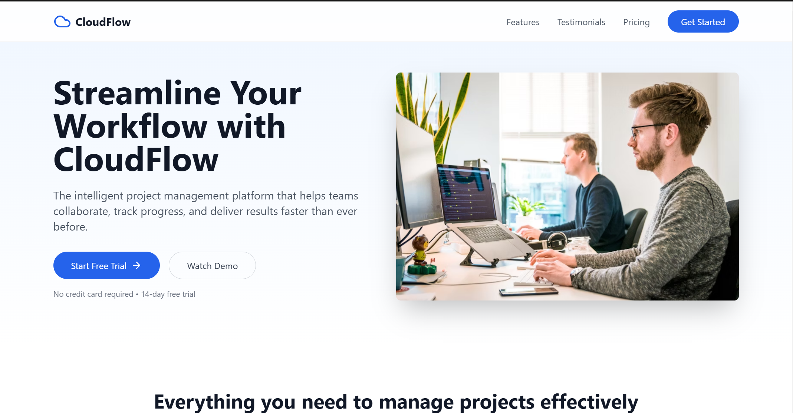

# CloudFlow Landing Page 🌥️🚀

CloudFlow is an intelligent project management platform designed to streamline workflows and enhance team collaboration. This landing page showcases the key features of CloudFlow, including a hero section, features, testimonials, and pricing information.

 <!-- Make sure the path is correct for your image -->

Check out the live version here: [CloudFlow Landing Page](https://astounding-kelpie-0a8390.netlify.app/) 🌐

## Features 🌟

- **Hero Section**: Provides an introduction to CloudFlow and call-to-action buttons for starting a free trial and watching a demo.
- **Features Section**: Highlights the core features of CloudFlow.
- **Testimonials Section**: Displays user reviews and testimonials.
- **Pricing Section**: Lists pricing plans for the platform.
- **Footer**: Includes important links and contact information.

## Technologies Used 🛠️

- **React.js**: JavaScript library for building user interfaces.
- **Tailwind CSS**: A utility-first CSS framework for styling the landing page.
- **Lucide Icons**: A set of SVG icons for UI elements (used for the menu and cloud logo).

## Getting Started 🏁

To get started with the CloudFlow Landing Page project, follow these steps:

### Prerequisites ⚙️

Make sure you have the following installed:

- **Node.js** (v14 or later)
- **npm** or **yarn**

### Installation 🔧

1. Clone the repository:

   ```bash
   git clone https://github.com/sultancodess/Landing-page.git
   cd Landing-page
